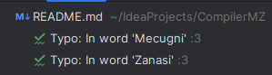

# CompilerMZ :computer:


CompilerMZ is a custom compiler and cross-compiler for multiple languages! \
It generates an x86_64 assembly file. The program is then executed by using nasm \
and ld.

## Table of Contents
- [Features](#features)
- [Inner workings](#inner-workings)
- [Getting Started](#getting-started)
- [Usage](#usage)
- [Grammar](#grammar)
- [The Idea](#the-idea)

## Features :sparkles:

- Multi dialect support :earth_africa:
  - Create your custom dialect
  - Current dialects supported:
    - default_dialect : a C vibe dialect :keyboard:
    - zanna : an italian dialect :it:
    - emilian : a dialect from Emilia-Romagna :spaghetti:
    - emoji : an emoji dialect, for the brave ones :smiley:
  - Full support for UNICODE characters, feel free to add yours!
- Comments :speech_balloon:
  - Single line comments
  - Multi line comments
- Variables :abacus:
  - Initialization
  - Declaration
  - Automatic check for already declared variables
- Exit :door:
  - Exit with variable
  - Exit by default(0)
- Arithmetic operations :heavy_plus_sign:
  - Addition
  - Subtraction
  - Multiplication
  - Division
  - Modulus
  - Parenthesis operations
- Logical operations :mag:
  - Equal
  - Not equal
  - Greater than
  - Greater or equal
  - Less than
  - Less or equal
  - And
  - Or
- If statement :triangular_flag_on_post:
  - Condition expression
  - Scope
  - Elif and Else
- Variable Reassignment :arrows_counterclockwise:
  - Reassign a variable
- While loop :repeat:
  - Condition expression
  - Scope

## Inner workings :gear:
To compile the .mz file, the steps made by the compiler are:
- Tokenization :scissors:
  - reads the input file and creates a list of tokens according to the dialect chosen 
  - transforms the chars present in the input file to tokens such as EXIT token
  - checks for unclosed multiline comments
- Parsing :deciduous_tree:
  - transforms the tokens list into a list of trees that represent the code
  - checks for syntax errors
  - checks for semantic errors
- Generating ASM :hammer:
  - part where the proper assembly is written into an output .asm file
  - checks for already declared variables
  - garbage collector for variables(removes variables out of scope)

CompilerMZ by default compiles the .asm file provided(-i) and generates the executable file. \
If not specified it will also generate the intermediate .asm assembly file(with comments!) and the object .o file.
## Getting Started :rocket:

To get the compiler working, you need to install `nasm` and `ld`:

```shell
sudo apt-get install nasm
sudo apt-get install ld
```

## Usage :hammer_and_wrench:
Here is the full man page:
```shell
MZ Compiler by Davide Mecugni, Andrea Zanasi
(C) 2024

usage: CompilerMZ
 -c,--compile            compile only, no assembly and linking
 -d,--dialect <arg>      dialect to be used
 -e,--executable <arg>   final executable file
 -f,--format             format the code, specify the dialect with -d flag
 -h,--help               print this message
 -i,--input <arg>        input .mz manz file
 -o,--output <arg>       output .asm assembly file
 -O,--object <arg>       .o object file(assembled .asm file)
 -t,--translate <arg>    cross-compiles a dialect to another one, requires
                         "dialectIn,dialectOut"
 -V,--version            print version
 -v,--verbose            verbose output
```

## Grammar :book:

For more details about the [EBNF](https://en.wikipedia.org/wiki/Extended_Backus%E2%80%93Naur_form) grammar of the language, please refer to the [grammar.md](grammar.md) file.

## The Idea :bulb:
The project was born during a OOP course at the University of Modena and Reggio Emilia. The idea was to create a compiler for a custom language, the .mz language.  
</img>